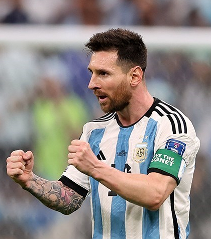

# Temas del curso

### 14/09 · Mis aficiones

Me gusta mucho jugar al tenis desde hace un par de años. Lo probé por hacer algo de deporte sin imaginarme que iba a llegar a ser algo tan significante en mi vida, porque cuando juego a tenis desconecto de todo lo demás, no pienso en nada más y me ayuda a despejar si tengo algún problema. Además, me encanta verme mejorar cada día y que cada día soy capaz de hacer cosas nuevas y estar más cerca de ser una jugadora importante. Mi mete es poder llegar a ser como Carlos Alcaraz y siento que cada día estoy más cerca.

Buscando en GitHub he encontrado [web de tenis](https://github.com/emilybache/Tennis-Refactoring-Kata) con normas para jugar a tenis.

---
### 30/09 · Premios Princesa de Asturias: Leo Messi

Leo Messi es uno de los futbolistas más importantes que existen hoy en día y que desde pequeño siempre mostró un gran talento en el fútbol. Comenzó jugando en el CF Barcelona, luego en el Paris Saint-Germain y por último en el Inter Miami CF. Además de que también formó parte de la Selección Argentina. Este año se retiró de su carrera como futbolista.
El jurado ha decidido darle a él el premio por su gran talento, su increíble trayectoria deportiva y por lo que hace para ayudar con la salud de los niños menos sanos, ya que el sufrió un problema de crecimiento. Además, de que es el futbolista con más premios y el que muestra mucho respeto, humildad y dedicación en el campo.
Yo escogí a Leo Messi por que me encantan los deportes y me parece una buena persona tanto con el resto del mundo como dentro del campo y eso es algo que pocos siguen haciendo. Creo que merece él el premio después de tanto esfuerzo.
[Su página en la Fundación](https://www.fpa.es/es/premios-princesa-de-asturias/premiados/2026-leo-messi/)

[Wikipedia commons](https://upload.wikimedia.org/wikipedia/commons/7/7f/Lionel_Messi_-_ARG_vs_MEX_-_FIFA_World_Cup_2022.jpg?utm_source=commons.wikimedia.org&utm_campaign=index&utm_content=original)

---
